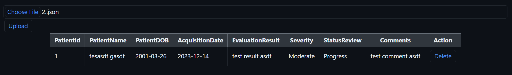

# Simple Patient Management App

Build a simple patient management app.



## Tasks

- Should be able to upload a medical file.
- Backend should be able to store that file while parsing the file to create a new table row.
- Should be able to browse the files through table view.
- Should be able to mutate the file.
- Use react-query caching strategy so that upon add/mutation of medical files, update the file object stored in cache accordingly, which will remove the need to fetch the data again in the table view.

## Environment

- Windows 11
- Node v20.15.1
- Npm 10.7.0

## Tech Stacks

- Vite + React + Typescript
- Express
- React Query
- PostgreSQL

## Steps to run program

1. Install node modules

   ```shell
   npm install
   ```

2. Create .env file

   ```env
   PORT="Port to host project"
   HOST="Address to host server"
   DB_HOST="Database host address"
   DB_PORT="Database port"
   DB_USERNAME="Database username"
   DB_PASSWORD="Database password"
   DB_DATABASE="Database name"
   ```

3. Run project
   ```shell
   npm run dev
   ```
   This will host the project on http://localhost:3000.
